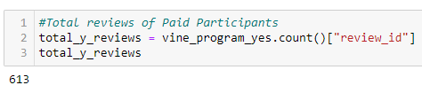
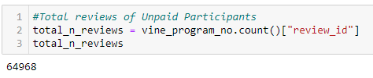
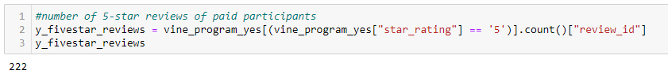
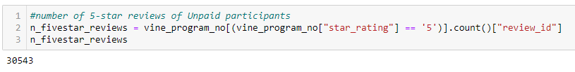
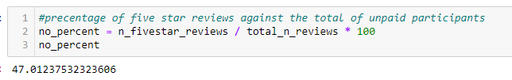

#  Paid Vs. Unpaid Amazon Vine Review Analysis
## Overview
Using Amazon AWS, PySpark, PostgresSQL, and Pandas, perform an analysis of product reviews from the ‘Wireless’ category of purchases. Then, examine the positive review percentages for participants and non-participants in the paid program. 

## Results
### Total Vine Reviews
- **Total**: 613

### Total Non-Vine Reviews
- **Total**: 64,968

### Total 5-Star Vine Reviews
- **Total**: 613

### Tota  5-Star Non-Vine Reviews
- **Total**: 64,968

### Percentage of 5-Star Vine Reviews
- **Total**: 613

### Tota  5-Star Non-Vine Reviews
- **Total**: 64,968

